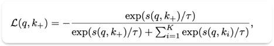
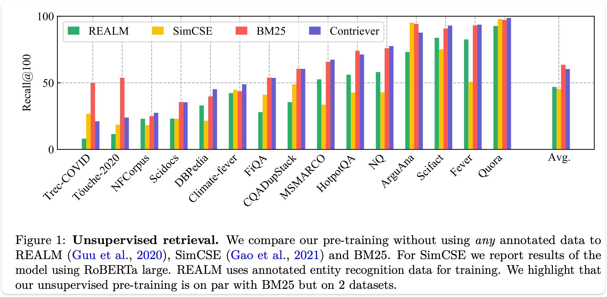
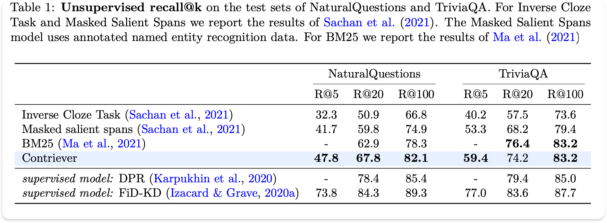
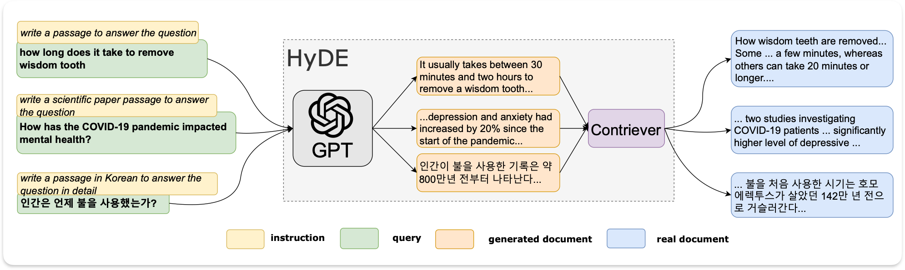
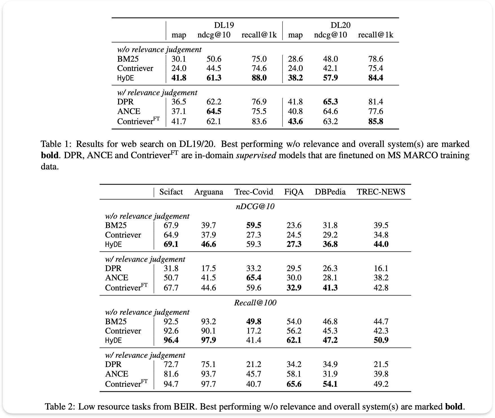

## Retrieval-Augmented Generation for Knowledge-Intensive NLP Tasks (2020, RAG)

--- 
## Unsupervised Dense Information Retrieval with Contrastive Learning (2021, Contriever)

Термин-частотные методы (например, BM25) не обладают пониманием языка, плохо работают в мульти-язычных условиях и имеют сложности с обобщением. С другой стороны, методы обучения с учителем требуют большого количества размеченных данных, которые не всегда возможно получить, и при этом могут показывать худшие результаты, чем традиционные методы. Альтернатива переносу знаний (transfer learning) - обучение без учителя, которое можно симулировать с задачей, похожей на извлечение.

**Вклад**:

1. Contrastive learning показывает результаты, сопоставимые с результатами BM25.
2. В условиях few-show learning показывает лучшие результаты, чем fine-tuned модели.
3. В качестве предобучения перед fine-tuning, этот метод приводит к лучшим результатам.

В архитектуре запросы и документы кодируются независимо, а скалярное произведение используется для оценки релевантности. В качестве энкодера используется один трансформер (в данной статье - BERT).

### Constractive learning

**q** - запрос, **t** - температура, **k+** - положительные документы, **ki** - отрицательные документы, **s** - скалярное произведение.

Функция потерь дает высокие оценки положительным парам и низкие оценки отрицательным. Другими словами, идея состоит в том, чтобы восстановить или извлечь все положительные документы среди всех отрицательных на основе запроса. Теперь вопрос в том, как выбирать положительные и отрицательные пары?

### Стратегия выбора положительных пар

1. Inverse cloze task - стратегия аугментации данных для генерации двух непересекающихся представлений документа. Первое представление - это выборка токенов из текста. Второе - дополнение первого представления (то есть оставшиеся токены, что не попали в выборку на первом шаге). ICT использует первое представление в качестве запроса и дополнение в качестве ключа. 

2. Cropping - выборка двух фрагментов токенов из одного и того же документа.

3. Замена слов, удаление и т.д.

### Стратегия выбора отрицательных пар

1. Внутри одного батча - использование одних и тех же ключей в одном батче. Однако для эффективности требуются чрезвычайно большие размеры батчей.

2. Использование предыдущих батчей - использование ключей из предыдущего и запросов из текущего батча. На практике ключи формируются предыдущей итерацией модели, но это приводит к снижению производительности. Поэтому использовался подход MoCo: ключи и запросы генерируются двумя разными моделями.

--- 

## Precise Zero-Shot Dense Retrieval without Relevance Labels (2022, HyDE)

Проблема zero-shot retrieval заключается в необходимости отображения документов и запросов в одно и то же векторное пространство, что является довольно трудно задачей без меток релевантности. Здесь же авторы изобрели эмбеддинг гипотетических документов для использования векторного пространства только документов. В двух словах: генерируем ответ на вопрос и ищем похожие в нашей базе данных.

**Генеративная задача**: мы создаем документ с помощью запроса к модели (Write a passage to answer the question). Документ хоть и может содержать фактические ошибки, но все же остается релевантным. В качестве модели используется InstructGPT.

Генерируется N документов и берется среднее из полученных эмбеддингов вместе с исходным запросом.

**Ищем похожий документ:** Ожидается, что эмбеддер также выступает в роли компрессора, позволяющего отфильтровывать галлюцинации. Реальные документы сравниваются с полученным вектором, и извлекаются наиболее похожие из них. В качестве эмбеддера используется Contriever.

