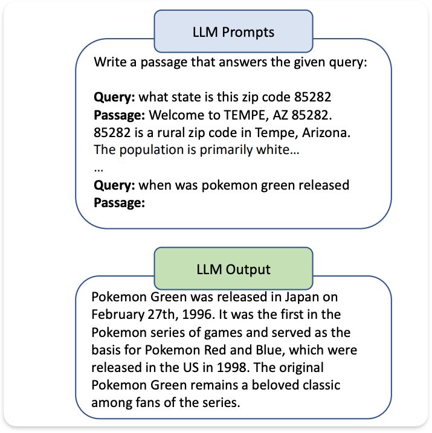

<!-- TOC -->
  * [Unsupervised Dense Information Retrieval with Contrastive Learning (2021, Contriever)](#unsupervised-dense-information-retrieval-with-contrastive-learning-2021-contriever)
  * [Precise Zero-Shot Dense Retrieval without Relevance Labels (2022, HyDE)](#precise-zero-shot-dense-retrieval-without-relevance-labels-2022-hyde)
  * [Query2doc: Query Expansion with Large Language Models (2023, Better HyDE)](#query2doc-query-expansion-with-large-language-models-2023-better-hyde)
  * [Is ChatGPT Good at Search? Investigating Large Language Models as Re-Ranking Agents (2023)](#is-chatgpt-good-at-search-investigating-large-language-models-as-re-ranking-agents-2023)
<!-- TOC -->

--- 
## Unsupervised Dense Information Retrieval with Contrastive Learning (2021, Contriever)

Термин-частотные методы (например, BM25) не обладают пониманием языка, плохо работают в мульти-язычных условиях и имеют сложности с обобщением. С другой стороны, методы обучения с учителем требуют большого количества размеченных данных, которые не всегда возможно получить, и при этом могут показывать худшие результаты, чем традиционные методы. Альтернатива переносу знаний (transfer learning) - обучение без учителя, которое можно симулировать с задачей, похожей на извлечение.

**Вклад**:

1. Contrastive learning показывает результаты, сопоставимые с результатами BM25.
2. В условиях few-show learning показывает лучшие результаты, чем fine-tuned модели.
3. В качестве предобучения перед fine-tuning, этот метод приводит к лучшим результатам.

В архитектуре запросы и документы кодируются независимо, а скалярное произведение используется для оценки релевантности. В качестве энкодера используется один трансформер (в данной статье - BERT).

<h3> Constractive learning </h3>

**q** - запрос, **t** - температура, **k+** - положительные документы, **ki** - отрицательные документы, **s** - скалярное произведение.

Функция потерь дает высокие оценки положительным парам и низкие оценки отрицательным. Другими словами, идея состоит в том, чтобы восстановить или извлечь все положительные документы среди всех отрицательных на основе запроса. Теперь вопрос в том, как выбирать положительные и отрицательные пары?

<!-- omit in toc -->
<h3> Стратегия выбора положительных пар </h3>

1. Inverse cloze task - стратегия аугментации данных для генерации двух непересекающихся представлений документа. Первое представление - это выборка токенов из текста. Второе - дополнение первого представления (то есть оставшиеся токены, что не попали в выборку на первом шаге). ICT использует первое представление в качестве запроса и дополнение в качестве ключа. 

2. Cropping - выборка двух фрагментов токенов из одного и того же документа.

3. Замена слов, удаление и т.д.

<h3> Стратегия выбора отрицательных </h3>

1. Внутри одного батча - использование одних и тех же ключей в одном батче. Однако для эффективности требуются чрезвычайно большие размеры батчей.

2. Использование предыдущих батчей - использование ключей из предыдущего и запросов из текущего батча. На практике ключи формируются предыдущей итерацией модели, но это приводит к снижению производительности. Поэтому использовался подход MoCo: ключи и запросы генерируются двумя разными моделями.

--- 

## Precise Zero-Shot Dense Retrieval without Relevance Labels (2022, HyDE)

Проблема zero-shot retrieval заключается в необходимости отображения документов и запросов в одно и то же векторное пространство, что является довольно трудно задачей без меток релевантности. Здесь же авторы изобрели эмбеддинг гипотетических документов для использования векторного пространства только документов. В двух словах: генерируем ответ на вопрос и ищем похожие в нашей базе данных.

**Генеративная задача**: мы создаем документ с помощью запроса к модели (Write a passage to answer the question). Документ хоть и может содержать фактические ошибки, но все же остается релевантным. В качестве модели используется InstructGPT.

Генерируется N документов и берется среднее из полученных эмбеддингов вместе с исходным запросом.

**Ищем похожий документ:** Ожидается, что эмбеддер также выступает в роли компрессора, позволяющего отфильтровывать галлюцинации. Реальные документы сравниваются с полученным вектором, и извлекаются наиболее похожие из них. В качестве эмбеддера используется Contriever.

---

## Query2doc: Query Expansion with Large Language Models (2023, Better HyDE)

Метод для zero-shot retrieval с использованием псевдодокументов. Несмотря на то, что идея частично заимствована у HyDE, этот подход можно использовать как для dense, так и sparse retrieval.

**Метод**

Для запроса _q_ используется подход с несколькими примерами, при котором выбирается k _(k = 4)_ пар из обучающего набора. Затем формируется новый запрос путем конкатенации исходного запроса и псевдодокумента _d_.

**Sparse retrieval**

Поскольку запрос, обычно, короче документа, его сбалансированность достигается путем повторения запроса n раз перед конкатенацией.

**Dense retrieval**

Новый запрос представляет собой конкатенацию исходного запроса и документа без повторений.

---

## Is ChatGPT Good at Search? Investigating Large Language Models as Re-Ranking Agents (2023)

Большинство методов в значительной степени зависят от ручных сигналов, которые требуют человека для разметки и демонстрируют слабую обобщаемость. Могут ли современные LLM превзойти настроенные модели в условиях zero-shot в задаче ранжирования? (Спойлер: могут)

**Метод**

Каждый фрагмент текста обозначается уникальным идентификатором ([1], [2] и т. д.). Мы просим LLM сгенерировать перестановку фрагментов в порядке убывания их релевантности к запросу в формате [2] > [3] > [1] > и т. д. (c на рисунке)

**Скользящее окно**

Из-за ограничений на количество токенов в LLM, предлагается использовать скользящее окно. В зависимости от размеров окна и шага LLM переранжирует фрагменты текста поочередно.

**Дистилляция знаний**

ChatGPT и GPT-4 дорогостоящи в использовании в коммерческих поисковых системах и в том числе могут увеличить задержку. Мы можем дистиллировать способности ChatGPT в маленькую модель.

Для достижения этого из MS MARCO выбираются 10 000 запросов с 20 кандидатными фрагментами, полученными с помощью BM-25 для каждого запроса. В качестве функции потерь рассматривается потеря RankNet.

_ri_ - ранг фрагмента, _si_ - оценка релевантности.

